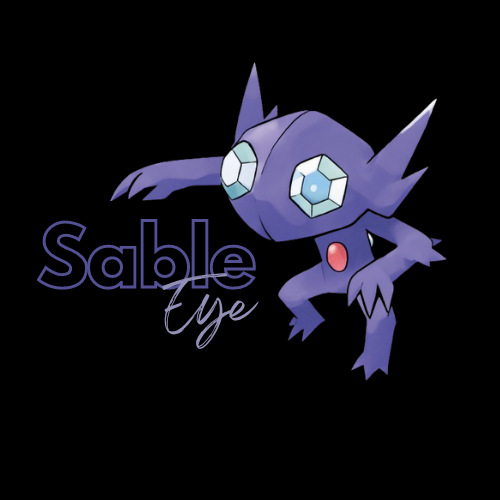

# SableEye
## Project Description!


**SableEye** is a lightweight keylogger tool designed for the *Windows* opertating system. The tool demonstrates how keystrokes can be captured and recorded by a key logger.

### Language Used


## Installation
### Steps
1. Clone the repository:
```git clone "https://github.com/Hemsagar11/SableEye.git"```
2. Navigate to SableEye Directory and run SableEye.exe:
```cd SableEye && .\SableEye.exe ```
3. Alternatively, the source code can be compiled using ```g++ -o SableEye sableEye.cpp```
4. A log file containing all the key strokes will be created as *Keystrokes.txt* but it would be **hidden**
5. Additional functionalities:
- To open up the log file while the program is still running use: ```CTLR + SHIFT + G```
- To quit or close the keylogger use: ```CTLR + SHIFT + Q```

## Features!
- Runs as a background process
- Captures all keystrokes
- Logs data to a file
- Uses minimal system resources

## Code Overview:
1. #### FreeConsole() function

- Detaches the program from the console window, making it run without a visible console.
2. #### GetAsyncKeyState(int vKey)

- Retrieves the state of a specified virtual key.The function returns -32767 if the key is currently pressed, and 0 if its not.

3. #### GetForegroundWindow()
- Retrieves a handle to the foreground window. Identifies the currently active window to log window titles or monitor user activity.
4. #### GetWindowTextA(HWND hWnd, LPSTR lpString, int nMaxCount)

- Retrieves the text of the specified window's title bar (if any).
5. #### SetFileAttributesA(const char* lpFileName, DWORD dwFileAttributes)

- Sets the attributes of a file or directory. It is used to set hidden attribute to the log file making it less visible.

## Protection Against Keyloggers

Keyloggers can pose a significant threat to privacy and security. Here are some recommended measures to protect against keyloggers:

1. Use Virtual Keyboards
2. Utilize Anti-Keylogger Software
3. Update Operating Systems and Applications
4. Use Updated Antivirus and Anti-Malware Software 
5. Enable Firewall Protection


## Disclaimer
**Important Notice:**

This software is provided for educational purposes only. Unauthorized use of this software to capture keystrokes without permission is illegal and unethical. By using this software, you agree to use it only in environments where you have explicit permission to monitor keystrokes. The developers are not responsible for any misuse of this software.

## Contribution

SableEye is currently closed-source. Contributions are not accepted at this time.


## License

This project is licensed under the MIT License - see the [LICENSE](https://github.com/Hemsagar11/SableEye/blob/main/LICENSE) file for details.

## Acknowledgements

Special thanks to [OpenGenus](https://iq.opengenus.org/keylogger-in-cpp/) resource for the tutorial and inspiration.

